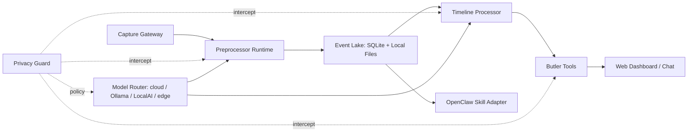

# OpenButler

OpenButler 是面向个人与家庭多用户的本地优先 AI 管家原型。这个 MVP 先验证 Web 产品形态、事件湖、插件流水线、隐私策略和 OpenClaw 技能适配，不追求移动端 all-in-one。

## 一条命令启动

```bash
docker compose up --build
```

启动后访问：

- Web Dashboard: <http://localhost:5173>
- Backend API: <http://localhost:8000>
- OpenAPI 文档: <http://localhost:8000/docs>

如果本机端口被占用，可以保持一条命令启动并改端口：

```bash
OPENBUTLER_BACKEND_PORT=8010 OPENBUTLER_FRONTEND_PORT=5174 docker compose up --build
```

PowerShell：

```powershell
$env:OPENBUTLER_BACKEND_PORT=8010; $env:OPENBUTLER_FRONTEND_PORT=5174; docker compose up --build
```

也可以本地分开启动：

```bash
cd backend
python -m venv .venv
.venv\Scripts\activate
pip install -r requirements.txt
uvicorn app.main:app --reload
```

```bash
cd frontend
npm install
npm run dev
```

## 当前 MVP 范围

- Web Dashboard：今日上下文事件、已识别物品、光照评分、小成就。
- 数据接入页：相册、视频流、智能眼镜、备忘录、音频、定位、交易、智能家居、OpenClaw 技能。
- 视觉感知页：通过全局 `camera-eye` 本地眼睛技能感知 USB 摄像头状态，展示在场、姿态、注意力热区、疲劳提示和隐私控制。
- PC 操作感知页：通过 MineContext godview 技能接入本机 PC 操作上下文，展示查询、搜索、导入、摘要、工作流候选和隐私控制。
- 主动管家页：将 PC 活动事件聚合为统一时间线、今日指标、主动洞察、Butler Inbox、简报和目标反馈闭环。
- 插件流水线页：前处理、中处理、后处理插件展示，并显示隐私策略拦截结果。
- 时间线页：mock 事件列表，支持关键词搜索。
- 管家对话页：可 mock 回答“我的钥匙在哪”“今天光照够吗”“本周成就总结”。
- 隐私与部署页：basic / strict 模式切换，strict 会禁止云端模型、云 API 和外部 Webhook。
- 后端 API：`/health`、`/api/events`、`/api/events/simulate`、`/api/plugins`、`/api/chat`、`/api/privacy-mode`。
- 视觉感知 API：`/api/vision/cameras`、`/api/vision/session/start`、`/api/vision/session/stop`、`/api/vision/status`、`/api/vision/summary/today`。
- PC 操作感知 API：`/api/pc-activity/minecontext/status`、`/api/pc-activity/minecontext/query-at-time`、`/api/pc-activity/minecontext/search`、`/api/pc-activity/minecontext/import`、`/api/pc-activity/summary/today`。
- 主动管家 API：`/api/butler/home`、`/api/butler/timeline/rebuild`、`/api/butler/metrics/today`、`/api/butler/metrics?days=7`、`/api/butler/insights/generate`、`/api/butler/briefings/generate`、`/api/butler/context-recovery`。
- 主动管家验收 API：`/api/butler/readiness`、`/api/butler/mvp-report`、`/api/butler/demo/run`、`/api/butler/demo/reset`。
- 插件 manifest：从 `backend/app/plugins/*.json` 加载，字段包含 `id`、`name`、`stage`、`input_schema`、`output_schema`、`privacy_level`、`model_requirements`、`permissions`、`prompt_template`、`version`。

## 目录结构

```text
OpenButler/
  backend/
    app/
      main.py                 FastAPI API、SQLite 初始化、Privacy Guard
      integrations/           local eyes adapter、MineContext adapter
      modules/workstation_vision/
                              视觉感知 session、检测器、聚合、工具和测试
      modules/pc_activity_context/
                              MineContext PC 操作感知、导入、摘要和工具
      modules/butler_core/
                              主动管家核心、统一时间线、指标、洞察、Inbox、简报和目标
      plugins/                插件 manifest
    data/                     SQLite 数据库目录，Docker volume 挂载
    Dockerfile
    requirements.txt
  frontend/
    src/
      App.tsx                 6 个页面和核心交互
      lib/api.ts              API client
      styles.css              响应式应用样式
    Dockerfile
    package.json
  openclaw/
    SKILL.md                  OpenClaw 技能适配说明
  openclaw-skill/
    SKILL.md                  视觉感知 OpenClaw 技能声明
    tools.yaml                视觉感知工具声明
  docs/
    privacy/vision.md
    privacy/minecontext_pc_activity.md
    privacy/proactive_butler.md
    vision.md
    minecontext_integration.md
    proactive_butler_core.md
  docker-compose.yml
```

## 原型架构



## 隐私模式

- `basic`：允许授权的云 API、外部 Webhook、云模型 Provider，适合快速验证体验。
- `strict`：禁止外部网络模型调用、云端 API 和外部 Webhook；只允许本地、端侧或明确 strict 级别插件运行。

Privacy Guard 目前在 `/api/plugins` 返回每个插件的 `runtime.available` 和 `runtime.blocked_reasons`，前端会据此展示可运行或被拦截状态。

## Vision 感知

默认使用全局 `camera-eye` 本地眼睛技能，不再走 mock。可用摄像头来自：

```text
C:\Users\admin\.codex\skills\camera-eye
```

常用验证：

```bash
curl http://localhost:8000/api/vision/cameras
curl -X POST http://localhost:8000/api/vision/session/start \
  -H "Content-Type: application/json" \
  -d '{"camera_id":"usb-camera-0","fps":1,"privacy_mode":"strict","save_raw_frames":false,"user_confirmed":true}'
curl http://localhost:8000/api/vision/summary/today
```

如需强制 mock 模式：

```powershell
$env:OPENBUTLER_VISION_MOCK=1
```

strict 隐私模式下，视觉感知强制本地处理并默认丢弃原始画面。用户可以在 Web 的“视觉感知”页面启动/停止分析、删除今日数据或删除全部视觉感知数据。

## PC 操作感知

默认复用已经实现的 MineContext godview 脚本：

```text
C:\Users\admin\Documents\Codex\2026-05-21\pc-windows10-minecontext-volcengine-minecontext-https\tools\run_minecontext_godview_query.ps1
C:\Users\admin\Documents\Codex\2026-05-21\pc-windows10-minecontext-volcengine-minecontext-https\tools\run_minecontext_godview_search.ps1
```

默认 MineContext 数据目录：

```text
C:\Users\admin\AppData\Local\MineContext
```

可用环境变量：

```powershell
$env:OPENBUTLER_MINECONTEXT_WORKSPACE="C:\path\to\minecontext-godview-workspace"
$env:OPENBUTLER_MINECONTEXT_HOME="C:\Users\admin\AppData\Local\MineContext"
```

常用验证：

```bash
curl http://localhost:8000/api/pc-activity/minecontext/status
curl -X POST http://localhost:8000/api/pc-activity/minecontext/query-at-time \
  -H "Content-Type: application/json" \
  -d '{"when":"今天9点10分","window_minutes":10}'
curl -X POST http://localhost:8000/api/pc-activity/minecontext/search \
  -H "Content-Type: application/json" \
  -d '{"query":"小红书网站","limit":5}'
curl -X POST http://localhost:8000/api/pc-activity/minecontext/import \
  -H "Content-Type: application/json" \
  -d '{"lookback_hours":24,"limit":200}'
curl http://localhost:8000/api/pc-activity/summary/today
```

MineContext 接入默认只读，不修改 MineContext 数据，不复制截图，只保存截图路径。strict 模式下禁止外部模型和外部 webhook；MineContext 生成文本只作为线索，远程系统状态必须回源验证。

## 主动管家核心

主动管家核心基于已导入的 PC Activity 事件生成统一时间线、今日指标、主动洞察、简报和反馈闭环。

常用验证：

```bash
curl -X POST http://localhost:8000/api/butler/timeline/rebuild
curl http://localhost:8000/api/butler/metrics/today
curl "http://localhost:8000/api/butler/metrics?days=7"
curl -X POST http://localhost:8000/api/butler/insights/generate \
  -H "Content-Type: application/json" \
  -d '{"force":true}'
curl http://localhost:8000/api/butler/home
curl -X POST http://localhost:8000/api/butler/briefings/generate \
  -H "Content-Type: application/json" \
  -d '{"type":"evening"}'
curl -X POST http://localhost:8000/api/butler/demo/run \
  -H "Content-Type: application/json" \
  -d '{"lookback_hours":24,"limit":200,"briefing_type":"evening"}'
curl http://localhost:8000/api/butler/mvp-report
curl http://localhost:8000/api/butler/productization/demo-pack
curl -X POST http://localhost:8000/api/butler/demo/reset
```

如果后端已在 `127.0.0.1:8010` 运行，也可以用本地 smoke 命令检查完整演示闭环：

```powershell
cd frontend
$env:OPENBUTLER_API_BASE_URL="http://127.0.0.1:8010"
npm run smoke:butler-demo
npm run smoke:butler-reset
npm run smoke:butler-mvp-report
npm run smoke:butler-demo-pack
npm run smoke:butler-browser
npm run smoke:butler-l1-audit
npm run artifact:butler-demo-pack
npm run test:demo-pack-artifact-file
npm run verify:productization
npm run smoke:butler-data-insufficient-drill
```

`smoke:butler-reset` 只清理 OpenButler 派生的统一时间线、指标、洞察、简报和 Productization Harness 摘要，不删除 PC Activity 事件、MineContext 数据库或 MineContext 截图文件。

`smoke:butler-mvp-report` 先运行演示闭环，再读取 `/api/butler/mvp-report`，校验 MVP 链路、验收项、证据边界、strict 隐私字段和 MineContext 源数据保留状态，最后执行安全 reset。

`smoke:butler-demo-pack` 先运行演示闭环，再读取 `/api/butler/productization/demo-pack`，校验一页演示包、目标自检、最近 Harness 摘要、证据边界和 strict 隐私字段，最后执行安全 reset。

`smoke:butler-browser` 会通过本地 headless Edge/Chrome 打开构建后的 `/butler` 页面，校验 Productization Harness、目标自检、一页演示包、证据边界、strict 隐私字段，并点击 `演练空数据路径` 验证 `dry_run=true` 和 `mutates_data=false`。它只使用本地浏览器和本地 API，不新增云端依赖、不复制截图、不删除 MineContext 源数据。

`smoke:butler-l1-audit` 会读取 `/api/butler/productization/l1-audit`，逐项校验 `.openbutler/goals.yaml` 的 active objectives 和 success criteria 是否有本地证据、证据边界和 strict 隐私字段。它会区分 `proven`、`needs_attention`、`missing_evidence` 和 `out_of_scope`。

`artifact:butler-demo-pack` 会生成 `data/productization/productization-demo-pack.json`，用于本地 CI 或人工验收读取。该 artifact 只包含 OpenButler 派生的 Productization Harness 状态、隐私计数和证据边界，不包含 MineContext 源记录、截图内容、raw godview output 或外部系统状态。

`test:demo-pack-artifact-file` 可离线校验上述 artifact 的 schema、ready/proven 状态、证据边界和隐私字段，不需要后端运行，也不会读取 MineContext 源数据。

`verify:productization` 是当前 Productization Harness 的一键本地验收命令。它要求后端已运行，会先检查 `/health`，再执行静态检查、前端构建、`smoke:butler-demo-pack`、`smoke:butler-l1-audit`、artifact 生成、离线 artifact 校验和 headless `/butler` 浏览器验收。该命令不会调用外部模型、复制截图、删除 MineContext 源数据或验证远程仓库、CI、云效、部署、线上服务状态。

Productization Harness 的本地变更记录和演示记录在：

```text
CHANGELOG.md
docs/productization/DEMO_RECORD.md
```

`npm run test:productization-records` 会校验这些记录包含验收命令、artifact 路径、API 证据面和 strict 隐私边界，并确认它们不包含 MineContext 原始记录、截图内容、raw godview output 或截图文件路径。

`smoke:butler-data-insufficient-drill` 读取 `/api/butler/demo/data-insufficient-drill`，校验合成空数据恢复路径。该演练是只读 `dry_run`，不会导入真实 PC Activity、不会重建真实时间线、不会复制截图、不会删除 MineContext 源数据，也不会调用外部模型。

Web 页面：

- 主动管家：`/butler`
- Butler Inbox：`/butler/inbox`
- Metrics：`/metrics`
- 统一时间线：`/timeline`
- Goals：`/goals`

`/butler/inbox` 支持展开每条洞察的证据详情，展示 `evidence_refs`、`evidence_boundary`、confidence、source/type/status。截图证据只显示路径引用，不复制、不读取、不上传截图内容；证据缺失时显示数据不足说明，不把缺失证据包装成确定结论。

`/metrics` 会展示今日 PC 活跃、深度工作、上下文切换和最近 7 天趋势。趋势来自 OpenButler 本地 metric snapshots；数据不足时显示空状态，不推断趋势、不调用外部模型、不复制截图、不删除 MineContext 源数据。

`/butler` 页面包含 `Productization Harness` 区块，会读取 `/api/butler/mvp-report`，展示 MVP 链路、验收项、下一步动作、证据边界和 strict 隐私字段。报告不是外部写入执行器；失败项只给出本地修复建议，例如导入 PC Activity、重建统一时间线或生成今日指标。页面按钮只执行白名单本地动作或页面跳转，不会调用外部模型、复制截图、写外部系统或删除 MineContext 原始数据。

`/api/butler/demo/data-insufficient-drill` 可用于验收“数据不足时不编造结论”的产品化边界。它返回 `data_insufficient`、每项 `next_action`、隐私字段和证据边界，但明确标记为合成演练，不代表当前真实工作区状态。

`/butler` 页面也提供 `演练空数据路径` 按钮来调用该只读演练。该按钮只读取本地 API，不会导入真实 PC Activity、重建真实时间线、生成真实洞察、复制截图或删除 MineContext 源数据。

`/api/butler/harness/runs/latest` 返回每类 Productization Harness 最近一次本地摘要，`/butler` 会在 `最近 Harness 结果` 区块展示它。摘要只保存状态、失败项、隐私计数和证据边界，不保存 MineContext 原始记录、截图内容、复制截图或外部系统状态。`/api/butler/export` 会导出这些摘要，`DELETE /api/butler/data` 会删除这些摘要；两者都不会触碰 MineContext 源数据。

`/api/butler/productization/objectives/status` 会读取 `.openbutler/goals.yaml` 的 active objectives，并把目标 id、标题、优先级和 success criteria 映射到当前本地证据，`/butler` 会在 `目标完成度自检` 区块展示它。该自检只读取本地 API、仓库文件和 Productization Harness 状态，不调用外部模型，不验证远程仓库、CI、云效、部署或线上服务。

如果后续在 `.openbutler/goals.yaml` 声明了新的 active objective，但还没有对应的 evidence mapper，API 会返回 `needs_attention` 和 `evidence_mapper_missing`，`/butler` 会显示 `缺少 evidence mapper`，避免产品目标静默失效。

`/api/butler/productization/demo-pack` 汇总 readiness、MVP report、目标自检和最近 Harness 摘要，`/butler` 会在 `一页演示包` 区块展示它。它是本地验收入口，不调用外部模型、不复制截图、不删除 MineContext 源数据，也不确认远程仓库、CI、云效、部署或线上服务状态。

主动管家默认不发送系统通知，不调用外部模型，不自动执行外部写入动作。用户反馈会降低不准确或过于频繁洞察的后续优先级。

## 后续路线

1. 数据层从 SQLite 扩展到 PostgreSQL + pgvector，原始对象进入 MinIO，分析视图进入 DuckDB。
2. Model Router 接入真实 provider：cloud API、本地 Ollama/LocalAI、端侧模型。
3. Capture Gateway 增加真实上传、视频抽帧、音频转写、位置/交易/智能家居事件导入。
4. 插件 Runtime 增加沙箱执行、权限审计、prompt 版本管理和 evidence chain 回放。
5. OpenClaw Adapter 增加可执行 HTTP tool schema、鉴权和 per-user 授权。
